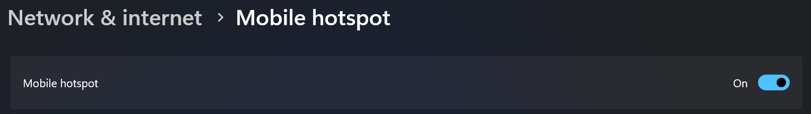
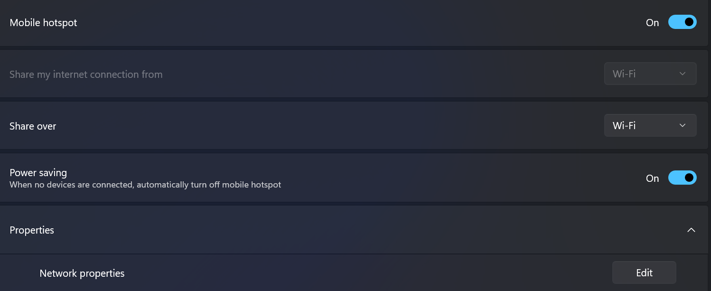
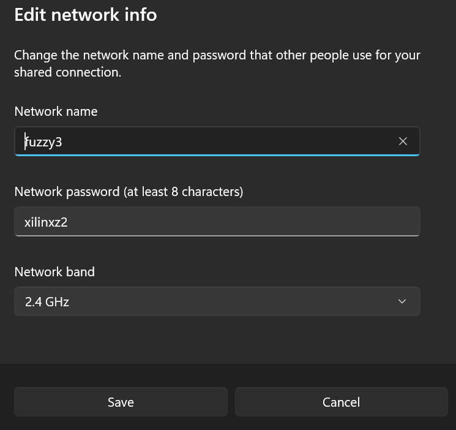

# How_to_connect_to-Pynq_Z2_via_dongle
How to connect to the RALink wifi dongle without ethernet.
Step 1: Go to Setting and turn on Mobile Hotspot

Step 2: Click on "edit" under properties

Step 3: Change the name and password to the desired board of choice.
Note: Set Band to 2.4GHz.
All names are different. All passwords remain the same.

